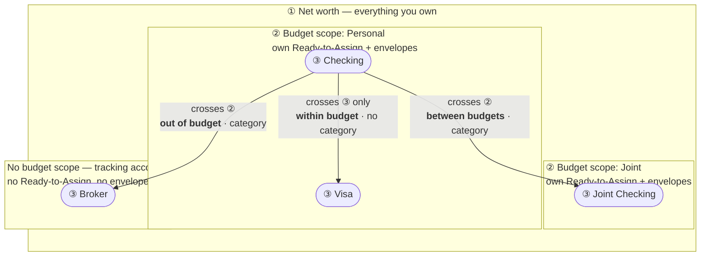

# Architecture

This explains how cash-money is built and *why*. It assumes you can program but
may not know TypeScript/React — unfamiliar terms are defined inline or in the
[README primer](../README.md#language--tooling-primer).

## The big picture: a pure core + a thin shell

```
        ┌─────────────────────────────────────────────┐
        │  apps/desktop  (React + Mantine, via Tauri)  │   the GUI you see
        │  renders state, dispatches "operations"      │
        └───────────────────────┬─────────────────────┘
                                 │ calls (function calls only)
        ┌───────────────────────▼─────────────────────┐
        │  packages/core  (plain TypeScript, no UI)     │   all the logic
        │  model · engine · import · ops · persistence  │
        └───────────────────────┬─────────────────────┘
                                 │ depends on interfaces ("ports"), not on the OS
                     ┌───────────▼───────────┐
                     │ FileSystemPort         │  disk (real app) or memory (tests)
                     └────────────────────────┘
```

**Why split it this way?**

- **Testability.** `packages/core` has no browser, no framework, no filesystem —
  so its 100+ tests run in about a second. The tricky money/merge logic is
  validated here, not through slow, flaky UI tests.
- **Portability.** The same core could power a different UI (web, mobile,
  command-line) with no changes. The UI is deliberately dumb.
- **Reasoning.** Money bugs are expensive. Keeping the math in small **pure
  functions** (same input → same output, no side effects) makes it auditable.

## The data model (`packages/core/src/model/types.ts`)

Everything is plain data (structs). In plain terms:

- **Budget** — the top-level container: a name, its currency, and the display
  order of households.
- **Account** — a place money lives (`checking`, `creditCard`, or off-budget
  `tracking` like investments). Carries an optional **household** label.
- **CategoryGroup** ("section") — a heading like "Everyday Expenses". Has a
  `kind` (`normal`, `income`, or `creditCardPayments`) and a household.
- **Category** — an envelope like "Groceries", belonging to a group.
- **MonthlyAssignment** — how much you budgeted to one category in one month.
  This is an *input* (a decision), so it's stored; everything else is derived.
- **Transaction** — one line in a register. Signed amount (inflow +, outflow −),
  a `date` and an `effectiveDate` (which month it counts toward — usually the
  same), `cleared` status, an `approved` flag (scheduled/future entries are
  unapproved until you approve them), and either a `categoryId`, a set of
  **splits** (across several categories), or a **transfer** link to another
  account.

Money is always an **integer number of minor units** (cents), never a
floating-point number — see `money.ts`. Floats can't represent `0.10 + 0.20`
exactly; integers can. All parsing goes through strings to avoid ever touching a
float.

## The envelope engine (`packages/core/src/engine/`)

`computeProjection(budget)` turns the stored data into everything the UI shows.
It's one pure function. The core recurrence, per category per month in order:

```
activity(c, m)  = Σ signed amounts of c's lines whose effectiveDate is in month m
available(c, m) = available(c, m−1) + assigned(c, m) + activity(c, m)
```

with one twist: an envelope that ends a month **negative restarts at zero** the
next month (overspending never rolls forward as a red balance — see the
credit-card paragraph for where the shortfall goes instead).

**Ready-to-Assign is derived by conservation.** Instead of tallying income minus
assignments, each household's Ready-to-Assign is *the cash it actually holds
(its non-card account balances) minus everything already sitting in its
envelopes*. Money can't be counted twice or lost: if you emptied every envelope,
Ready-to-Assign would equal your account balances exactly. The global banner is
the sum across households, so banner and breakdown can never disagree. A **cash**
overspend automatically shows up as reduced Ready-to-Assign (the money left the
account and no envelope holds it); a **credit** overspend stays as debt on the
card and doesn't touch it.

**Credit cards (the subtle part).** When you spend on a credit card in a budgeted
category, the *covered* amount — what the envelope could afford, judged at month
end so money assigned later in the month still counts — is moved into that card's
payment envelope, so cash is set aside to pay the card. Whatever the envelope
couldn't cover remains as debt on the card. A refund on the card draws the
payment envelope back down, and paying the card (a transfer into the card
account) draws it down too. Validated to the cent against real exported plan
numbers: derived activity and available match 100% of category-month cells.

**Households.** Accounts, sections, and categories carry a household label. Each
household is its own money pool with its own Ready-to-Assign (computed as
above) — a household is really a **budget scope**, not a claim about who owns
the money. Money moving between households stays exactly as the source budgets
recorded it — a categorized expense on the sending side, income on the receiving
side — which is what makes each household's number come out right. See
[Transfers: three nested boundaries](#transfers-three-nested-boundaries).

**Off-budget accounts.** Tracking accounts (investments) don't affect envelopes;
their balances are shown but excluded from the budget math. Unapproved
(scheduled) transactions are excluded until approved.

## Transfers: three nested boundaries

Every account you own sits inside three rings. A transfer is defined by the
outermost ring it crosses, and that alone decides what it means.



**Ring ③ — the account.** A transfer that crosses only this (Checking → Savings
in the same household, or paying your own Visa) is a pocket-shuffle. It carries
no category, the engine treats it as a no-op, and envelopes, Ready-to-Assign,
net worth and the spending analytics all ignore it.

**Ring ② — the budget scope.** This is what a *household* actually is: a set of
on-budget accounts sharing one Ready-to-Assign and one set of envelopes. Money
crossing it leaves this budget's spendable pool, so the outflow leg **carries a
category** — it spends an envelope exactly like a regular payee, which is what
keeps the sender's Ready-to-Assign whole. Two flavours, identical mechanically:

- **between budgets** — to another household. The receiving budget's
  Ready-to-Assign rises on its own through the cash pool; that side needs no
  category.
- **out of budget** — to a tracking account. Still your money, but no budget
  receives it, so nothing rises anywhere. Funding investments is planned
  spending from the budget's point of view, and this is how it gets planned.

**Ring ① — net worth.** Nothing internal crosses it. Only real income and real
expenses do. That's why *every* transfer, categorized or not, nets out of the
global analytics: your total didn't move, only which pocket held it. Drill into
one account and you see the real outflow from *there*.

| crosses | category | envelope | that budget's RTA | net worth | global analytics |
| --- | --- | --- | --- | --- | --- |
| ③ account | none | — | — | — | ignored |
| ② budget scope | on the outflow leg | spent | sender held whole; receiver's rises | — | netted out |
| ① net worth | n/a — that's a payee, not a transfer | spent | falls | falls | counted |

The one asymmetry worth remembering: **a tracking account belongs to your
household but to no budget.** That is why moving cash to the broker asks for a
category while moving it to your own savings does not.

**Transfers hiding in imported data.** A transfer between two budgets arrives as
two unrelated rows — an envelope spend in one export, income in the other —
because that's how each source recorded it. `findTransferCandidates`
(`transferPairing.ts`) turns up those pairs: equal-and-opposite, crossing a
budget scope, close in date, each row used once, ranked by evidence rather than
arithmetic (a same-size coincidence never counts as confident). `ops.linkTransfers`
then links them, and the "Link transfers…" screen reviews the list before
anything happens. This is **not** the old cross-budget stitch that was removed:
nothing is merged or dropped, the sending leg keeps its funding envelope, and a
test asserts every projection number is identical before and after. What changes
is the payees and the fact that the pair no longer has to be guessed at.

**Draining Ready-to-Assign is allowed, but only on purpose.** Money can leave
the pool without an envelope — that's what happens when a categorized line
isn't there — and sometimes that's exactly right (an unplanned contribution,
a lump into investments you never budgeted). So the category picker offers the
household's income categories under **Unbudgeted money**: choosing "Ready to
Assign" drains the pool and touches no envelope, which is arithmetically
identical to leaving the field blank but is a decision on the record. Rows that
never made that decision — any on-budget outflow with no category that isn't a
same-scope pocket shuffle — are flagged **needs a category** in the register and
counted in the account header, so the drain is never silent.

## Payees: identity, and the names banks use

A bank names a row its own way — `AS Northwind Bank`, `EXAMPLECO OÜ`,
`RIDECO.EU/O/1234567890`, `FRUITCO.COM/BILL` — or not at all, for the things the bank
did to you (interest, fees, standing orders, ATM withdrawals). Measured against
real statements, barely one row in ten arrives carrying a name its owner uses.

So there is a **payee master list** (`Payee`: id, name, aliases). Transactions
still carry payee *text*: the engine never reads payees, analytics groups by
name, and threading an id through every row would buy nothing. What the id buys
is a mapping that outlives a spelling — rename every `Northwind` row to `AS Northwind Bank`
and its aliases still point at the same entry, because they hang off identity
rather than text. `ops.renamePayee` keeps the two in step, and renaming onto a
name already in use merges the entries and keeps both sets of aliases.
`ops.syncPayees` mints an entry for every spelling the transactions use; it runs
on every load and is idempotent, so a payee typed straight into the register
turns up in the list without ceremony.

An incoming row is named by the first of three answers that applies
(`import/payee.ts`):

1. an **alias** you recorded — exact, deterministic, and yours;
2. a **match** against your existing payees — strip the legal form (`AS`, `OÜ`,
   `GmbH`), tokenise, and take the most specific payee whose every word appears
   in the bank's string. On real statements this alone names three rows in four,
   `RIDECO.EU/O/1234567890 → Rideco` included. It is deliberately conservative:
   never a partial word, never a token under three characters, so a first-time
   merchant keeps the bank's name rather than wearing someone else's;
3. the **description**, stripped of account numbers, card masks, dates and the
   period marker a recurring fee names — dropping `06.2026` is what makes this
   month's fee derive the same name as last month's, and therefore match it.

The category comes from whatever that payee was last filed under, derived rather
than stored so it cannot go stale.

Only aliases are persisted, and only from **corrections**: accepting a suggested
match teaches nothing, and strings carrying a per-transaction id would fill the
list with keys that never recur. Aliases are visible and removable in the Payees
screen, so a bad one is a click to undo rather than something buried in history.
The three-way merge unions alias lists rather than picking a winner — an alias
learned on the laptop and another learned on the desktop are both true.

## The import pipeline (`packages/core/src/import/`)

Imports are **format-driven**: nothing about any particular app's CSV shape is
hardcoded. A `RegisterFormat` (in `format.ts`) is a plain-JSON description of
one CSV shape — which columns hold what, the date layout, signed vs in/out
amounts, cleared/flag vocabularies, how transfers are recognized, and which
group names carry special meaning (income, hidden, card payments). Everything
downstream consumes a format-neutral staged representation, never a vocabulary.

**The format library** lives in `import/formats/` as one JSON file per known
shape, validated against a zod schema by a guardrail test. To add a format:
drop a `<slug>.json` (id `lib:<slug>`) in that directory, add one line to
`formats/index.ts`, and the tests pick it up. User-created mappings are saved
by the app to `formats.json` in the data folder and appear in the wizard's
picker next to the library ones.

There are two entry points sharing the same stages:

**Snapshot import (`stageImport`)** — one or more full budget exports, merged
into a fresh staging budget. Per source (each with its own format + as-of
date): `register.ts` maps rows via the descriptor; `planCsv.ts` reads the
optional Assigned CSV; `transactions.ts` reconstructs splits; then across all
sources: `transfers.ts` pairs within-budget transfer legs (cross-budget
movements stay exactly as recorded — "stitching" them was tried and removed
because both budgets end up claiming the same money), `accounts.ts` and
`categories.ts` build the unified tree, `identity.ts` fingerprints every row
(content identity + occurrence index — what makes re-import **idempotent**),
`plan.ts` imports Assigned amounts (deriving activity/available; the export's
own numbers become a test oracle), and `resolve.ts` produces final records.

**Statement import (`stageStatement`)** — a single-account CSV (a bank's own
export) merged into the EXISTING budget. Rows carry the same content identity,
under a stable per-account source key, so re-importing the same or an
overlapping statement adds nothing. Statement merge never deletes and never
overwrites — a row you categorized in-app stays categorized when the same row
arrives again.

`reconcile.ts` also holds the snapshot-side diff (added/changed/deleted,
preserving in-app edits) — currently used by the validation scripts; wiring it
into the wizard's commit (instead of replace) is a planned follow-up.

Concrete names (source labels, household names) are supplied as **config at
runtime**, never hardcoded — so no personal data lives in the source.

## Editing: the ops layer (`packages/core/src/ops.ts`)

Every user action that changes the budget is a pure function
`(budget, args) => newBudget`: `addTransaction`, `moveMoney`, `reorderCategory`,
`renameGroup`, `setSplits`, `setHouseholdOrder`, and so on. The UI never mutates
data directly — it dispatches one of these and re-renders from the result. That's
why "does feature X do the right thing?" is answered by a fast unit test of the
op, not by clicking around.

## Persistence (`packages/core/src/persistence/`)

The whole budget lives in **one `.cashmoney` file** (`budgetFile.ts`): a single
JSON document containing the budget, accounts, categories, assignments, every
transaction, plus the user's saved statement mappings and per-account statement
sources — so the file is fully self-contained. It is serialized
deterministically (sorted keys, id-sorted collections), which makes two saves of
the same data byte-identical, and written **atomically** (temp file + rename).
The file can live anywhere — putting it in a cloud-synced folder (iCloud Drive,
Dropbox, Syncthing) is the supported way to use one budget on several machines,
**including at the same time**: the app watches the file (poll + on refocus), an
idle machine silently follows another machine's saves, and when both machines
hold changes a **three-way merge** (`merge3.ts`) folds them together — base is
the last synced state, every collection merges by stable key, deletions never
beat edits, and the only true conflict (the same record edited differently on
both sides) is resolved local-wins with a toast reporting it. The mtime guard
remains the write-time tripwire that triggers the merge; a blocking banner
appears only when merging itself is impossible (unreadable file, newer format).
A `.bak` sibling of the previous session's state is kept alongside.

The tiny `app.json` in the platform app-data folder only remembers *which* file
to follow. The older multi-file layout (`repository.ts`: per-slice JSON +
month-sharded NDJSON behind a `FileSystemPort`) remains as the migration source
— on first run the app assembles a `.cashmoney` file from it and leaves the old
files untouched.

## UI state flow (`apps/desktop/src/state.tsx`)

One store holds the current `LoadedBudget`. On any change it recomputes the
projection with `computeProjection` (memoized) and re-renders. Components read
from the store and call ops. In the desktop app every change rewrites the
budget file with a short debounce; saves are serialized (never overlapping),
guarded by the file's last-seen mtime, and flushed before the window closes. In
a plain browser the store is seeded with a synthetic demo budget (`demo.ts`) so
the UI renders without any real data or persistence.

## Keeping private data out (`.githooks/`)

The repository is public; the budget it manages is not. Real statements are the
best evidence for how import should behave, which makes it easy to paste a real
bank, employer or account number into a test fixture or a commit message while
reasoning from them — the *shape* is what a test needs, and the identity comes
along for free.

So it's enforced rather than remembered. `git config core.hooksPath .githooks`
(run once per clone) installs a `pre-commit` and `commit-msg` pair that scan
added lines and the message, and refuse the commit on a match. Two kinds of
pattern:

- **shapes**, in the hook itself, because a shape names nobody: anything
  IBAN-like, and card masks. The published placeholders used in the tests
  (`GB29NWBK60161331926819`, `(..1234)`) are allowed through, so the rule can't
  block the invented values it exists to encourage.
- **names**, in `$GIT_COMMON_DIR/private-patterns`, one regex per line —
  deliberately *outside* the repo, since a list of what must not be published is
  itself the thing not to publish. A fresh clone starts without it; recreate it.

`git commit --no-verify` bypasses both when you mean to.

## Testing

- **Unit + property tests** in `packages/core` (money round-trips, the envelope
  recurrence, money conservation, import idempotency, every op).
- **Synthetic fixtures first** for the merge — one for each real-world oddity
  (splits, mirrored transfers, near-duplicates, whitespace/case collisions,
  future-dated rows) — then validated against real data using the export's plan
  numbers as an oracle (derived activity and available match 100% of
  category-month cells).
- Run with `npm test`. The UI is intentionally thin, so it has no heavy test
  suite; its behavior is the ops layer it calls.

## Where things will go next

- **Targets** — nothing in the model expresses "this envelope needs €300 a
  month". Assignment is manual, helped by `suggest.ts` proposing what you did
  before. A target would be a new field on `Category` plus a column in the Plan
  view; the engine wouldn't change, since a target is an input like an
  assignment, not a derived number.
- **Recurring transfers** — `scheduledSuccessor` spawns the next occurrence of a
  scheduled row, but a transfer is two linked rows, so the successor has to be
  pair-aware. Repeat is disabled for transfers until it is.
- **Linking after an import** — `findTransferCandidates` is reachable from the
  sidebar, which is not when you need it. The import wizard's commit step is.
